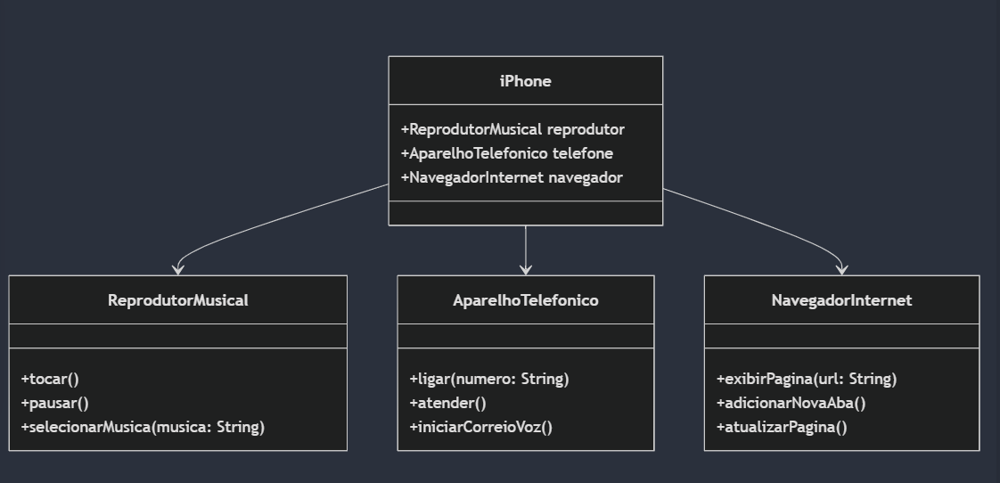

    classDiagram
        class iPhone {
            +ReprodutorMusical reprodutor
            +AparelhoTelefonico telefone
            +NavegadorInternet navegador
        }

        class ReprodutorMusical {
            +tocar()
            +pausar()
            +selecionarMusica(musica: String)
        }

        class AparelhoTelefonico {
            +ligar(numero: String)
            +atender()
            +iniciarCorreioVoz()
        }

        class NavegadorInternet {
            +exibirPagina(url: String)
            +adicionarNovaAba()
            +atualizarPagina()
        }

        iPhone --> ReprodutorMusical
        iPhone --> AparelhoTelefonico
        iPhone --> NavegadorInternet

  